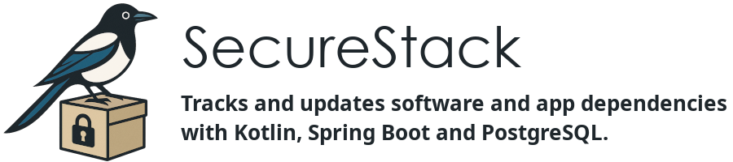

SecureStack is a full-stack Kotlin Spring Boot application that helps development
teams stay secure and up-to-date by monitoring software tools and project dependencies for version updates.
It supports GitHub login, team-based organization, app-specific configuration,
and sends email alerts when newer versions are available
— making dependency tracking simple, proactive, and secure.

**SecureStack** is a full-stack **Kotlin Spring Boot app**:
* Uses **PostgreSQL** database for storing 
  * **users** and **teams**, 
  * **teams software** (for example Git, Java, IntelliJ, Kotlin)
  * **applications and their software and Gradle/Maven dependencies** for version updates
* Sends **email alerts** on new versions
* Uses **GitHub OAuth** for authentication
* Includes a **Thymeleaf** frontend, packaged with the backend


Table of contents:
1. [🖥️ Run Locally](%EF%B8%8F-1-run-locally)
2. [☁️ Run at Hetzner (in the Cloud)](#%EF%B8%8F-2-run-at-hetzner-in-the-cloud)
3. [📁 App Structure](#-3-app-structure)
4. [🛠️ How the Application Was Created](#%EF%B8%8F-4-how-the-application-was-created)
5. [🐦️ Say Hello to Magpie - The Mascot for SecureStack](#%EF%B8%8F-5-say-hello-to-magpie---the-mascot-for-securestack)
6. [📜 License](#-6-license)

---

## 🖥️ 1 Run Locally


### 1.1 Install [PostgreSQL](https://www.postgresql.org/download). Linux and macOS: You should install pgAdmin also.

### 1.2 Create a PostgreSQL database named `securestack-dev`.

### 1.3 Download [IntelliJ IDEA Community Edition](https://www.jetbrains.com/idea/download).


### 1.4 Clone Repository and open it in IntelliJ:

In IntelliJ welcome screen use `Clone Repository` and enter
[https://github.com/ditlef9/securestack-kotlin-springboot-postgresql.git](https://github.com/ditlef9/securestack-kotlin-springboot-postgresql.git).

...or...

 [Download ZIP](https://github.com/ditlef9/securestack-kotlin-springboot-postgresql/archive/refs/heads/main.zip)

...or...

Use Git and clone the material:
```bash
git clone https://github.com/ditlef9/securestack-kotlin-springboot-postgresql.git
```

The Project uses the [latest LTS version of Java](https://www.oracle.com/java/technologies/java-se-support-roadmap.html).

### 1.5 Set application properties

Go to `src/main/resources/application.properties`:

* Update PostgreSQL username+password
* Update JWT Secret


---

## ☁️ 2 Run at Hetzner (in the Cloud)

---

## 📁 3. App Structure

```graphql
src
└── main
    ├── kotlin
    │   └── com
    │       └── securestack
    │           ├── auth         # GitHub OAuth config, user details service
    │           ├── config       # Security, mail, and app configurations
    │           ├── controller   # Web and REST controllers
    │           ├── domain       # JPA entities (User, Team, App, etc.)
    │           ├── dto          # DTOs for API input/output
    │           ├── repository   # Spring Data JPA interfaces
    │           ├── service      # Business logic and schedulers
    │           └── util         # Helper classes (e.g., version checkers)
    ├── resources
    │   ├── templates            # Thymeleaf HTML templates
    │   ├── static               # CSS, JS, images
    │   ├── application.yml      # Spring configuration
    │   └── mail                 # Email templates (optional)
    └── test                    # Your unit and integration tests

```


Tables:

```pgsql
+---------------------+           +---------------------+           +---------------------+
|        users        |           |        teams        |           |      software       |
|---------------------|           |---------------------|           |---------------------|
| id (PK)             |           | id (PK)             |           | id (PK)             |
| github_id (unique)  |           | name                |           | name                |
| username            |           +---------------------+           | current_version     |
| email               |                 ^       ^                   | latest_version      |
+---------------------+                 |       |                   +---------------------+
          ^                            *|       |*                        
          |                             +-------+                          
          |                          user_team (join table)                  
          |                          ----------------------                  
          |                          | user_id (FK -> users.id)              
          |                          | team_id (FK -> teams.id)              
          |                          +----------------------                  

+---------------------+           +----------------------------+
|     applications    |           |       app_dependencies      |
|---------------------|           |----------------------------|
| id (PK)             | <---1---* | id (PK)                    |
| name                |           | group_id                   |
| team_id (FK -> teams)|          | artifact_id                |
+---------------------+           | current_version            |
                                  | latest_version             |
                                  | app_id (FK -> applications.id) |
                                  +----------------------------+
```

---

## 🛠️ 4 How the Application Was Created

### 4.1 Created a starter at https://start.spring.io/

* Project: Gradle - Kotlin
* Language: Kotlin
Dependencies:
* Web:
	* Spring Web	To build REST APIs (backend)
* Security:
	* Spring Security	To secure endpoints and integrate GitHub login
	* OAuth2 Client	For GitHub OAuth login
* SQL:
	* Spring Data JPA	For working with PostgreSQL via JPA/Hibernate
	* PostgreSQL Driver	To connect to your PostgreSQL database
* Template Engines:
	* Thymeleaf 	Server-side rendered views (e.g. emails)
* I/O:
	* Validation	For input validation (e.g. form fields, request data)


### 4.2 Start with domain, repository, auth, and config


Add controller and service once your data model and login work.

* auth/GitHubOAuth2UserService.kt
* config/SecurityConfig.kt
* domain/User.kt
* domain/Team.kt
* domain/Application.kt
* domain/SoftwareTool.kt
* domain/Dependency.kt
* repository/UserRepository.kt
* repository/TeamRepository.kt
* repository/ApplicationRepository.kt
* repository/SoftwareToolRepository.kt
* repository/DependencyRepository.kt

### 4.3 DTOs

For returning clean JSON in controllers.

src/main/kotlin/com/securestack/dto/
* UserDto.kt
* AppDto.kt
* DependencyDto.kt
* TeamDto.kt

### 4.4 Service Layer

Create logic between controllers and repositories:

    UserService.kt

    TeamService.kt

    AppService.kt

    DependencyService.kt

### 4.5 Controller Layer

Start with:

    AuthController.kt (GitHub login flow)

    AppController.kt (create, list apps + dependencies)

    TeamController.kt (view team info)

Use:

    @RestController for API

    @Controller + @GetMapping for Thymeleaf views


### 4.6 HTML Frontend (Thymeleaf)

Simple templates for:

    login.html

    dashboard.html

    app-detail.html

Located in:
src/main/resources/templates/

---

## 🐦️ 5 Say Hello to Magpie - The Mascot for SecureStack


Every software team has *that* one teammate — 
the one who notices when your Spring Boot version is two releases behind… 
or when your `jjwt` dependency is older than your coffee.

That teammate is the **SecureStack Magpie**.

Magpies are **obsessed with shiny stuff**, and ours is no different — 
except instead of jewelry, it's addicted to **Java versions, Gradle builds, and sneaky old libraries**.

It perches on your project stack like a judgmental DevOps bird, 
watching every dependency you forget to update.
When it finds something outdated? Boom — **email alert sent**, feathers mildly ruffled.

🛠️ Tools?<br>
🔍 Versions?<br>
📦 Dependencies?<br>
If it exists, the Magpie wants to collect it, label it, and yell about it when it's out of date.

So yeah, SecureStack runs on Kotlin, Spring Boot, and the **anxious energy of a very organized magpie**.

Let it squawk so you don't have to.


---

## 📜 6 License


This project is licensed under the
[Apache License](https://www.apache.org/licenses/LICENSE-2.0).

You are free to use, modify, and distribute this software in both personal and commercial projects,
provided that you include a copy of the license and provide appropriate attribution.

There is no warranty, and the software is provided "as is."